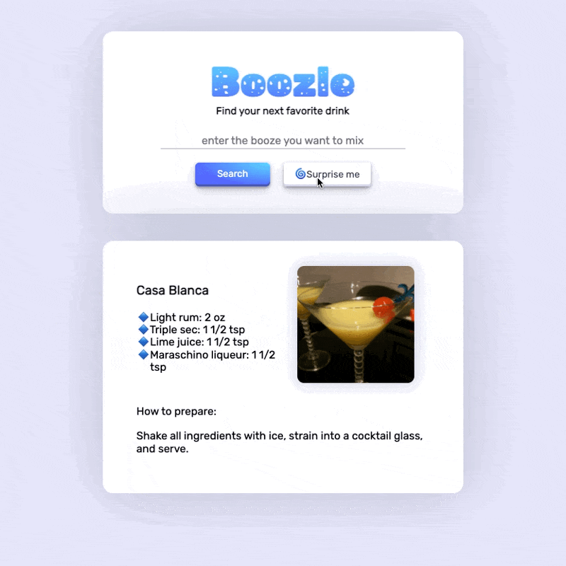

<section align="center">
    
    
    
</section>

 

I'm Roman, an **AdTech professional with product management and web development skills**.  
I’ve worked across startups and marketing agencies—leading advertising operations, managing digital products, and building web solutions to bring them to market.

 

## 🚀 Projects

<table>
  <tr>
  <td width="50%" valign="top">
     
      <h3 align="center">Paraswiper.com</h3>
        
         
        

        
      
      

        
<strong>MERN + Python, Tailwind CSS</strong> - Youtube anti-spam app to filter, report, and remove unwanted comments on videos.

    </td>
    <td width="50%" valign="top">
     
      <h3 align="center">Boozle: Cocktail Search App</h3>
      
         
        

  
  
      

        
<strong>HTML5, CSS3 & JS</strong> - Find surprisingly good cocktails with some of the drinks you already have or try new by clicking "Surprise me" button.

    </td>
  </tr>

  <tr>
  <td width="50%" valign="top">
     
      <h3 align="center">Portfolio Page</h3>
        
       
        

  
  
      

        
<strong>HTML5, CSS3, & Javascript</strong> - Portfolio Site including links to my projects and ways to get in contact with me.

    </td>
    <td width="50%" valign="top">
     
      <h3 align="center">3D Models Demo App</h3>
        
         
        

    
  
      

        
<strong>HTML5, CSS3 & JS</strong> – Demo slider to show off the different 3D models during sales and conference pitches.

    </td>
  </tr>
</table>

 

## 💼  Technologies
### Frontend

### Backend

